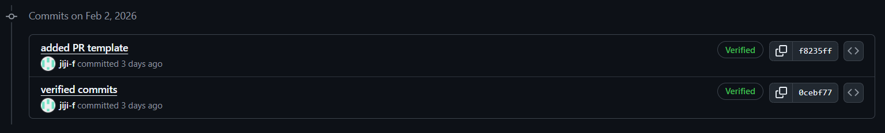
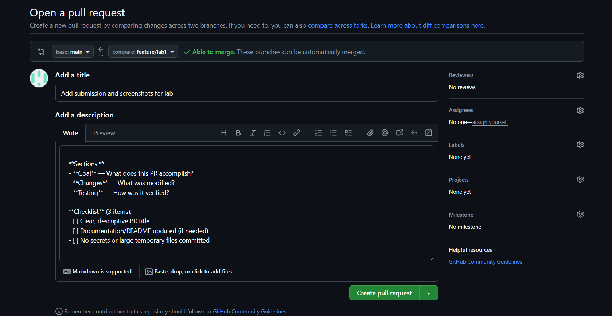
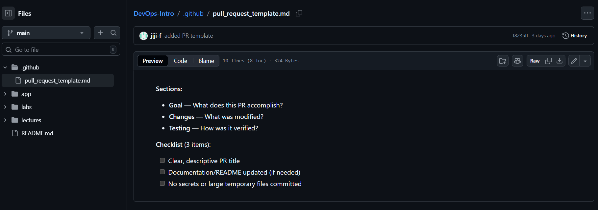

# TASK 1

## 1) A short summary explaining the benefits of signing commits.

Commit signing is needed to confirm that a commit was actually created by a specific developer and that its content was not changed after it was created. This increases trust in the code and protects the repository from author identity spoofing.

## 2) Evidence of successful SSH key setup and signed commit.

## 3) Answer: "Why is commit signing important in DevOps workflows?"

Commit signing is important in DevOps because code automatically goes through CI/CD pipelines and is deployed to production. When commits are signed, it is possible to be confident about who made the changes. This reduces security risks and simplifies change tracking in the project.

Commit signing guarantees the authenticity of the commit author, protects the software supply chain, prevents the introduction of malicious code by unauthorized parties, simplifies auditing and incident investigation, is considered a best practice in CI/CD and enterprise development, and is often required by security standards such as ISO, SOC 2, and internal security policies.
 

## 4) Screenshots or verification of the "Verified" badge on GitHub.

# TASK 2

## 1) Screenshot of PR template auto-filling the description.

## 2) Evidence that .github/pull_request_template.md exists on main branch.

## 3) Analysis of how PR templates improve collaboration.

PR templates improve collaboration by standardizing the structure of pull requests.

Reviewers always see the same sections (goal, changes, testing), which makes reviews faster and more consistent.

Templates reduce misunderstandings because contributors are guided to provide all required information.

Checklists help ensure basic quality requirements are met before merging.

Overall, PR templates improve communication and reduce review time in team workflows.
## 4) Note any challenges encountered during setup.
One challenge was figuring out where the PR template should be placed and in which branch.
After adding the template to the main branch, it was applied automatically.
